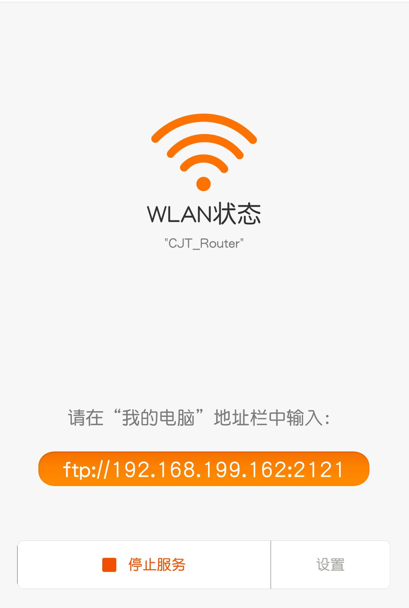
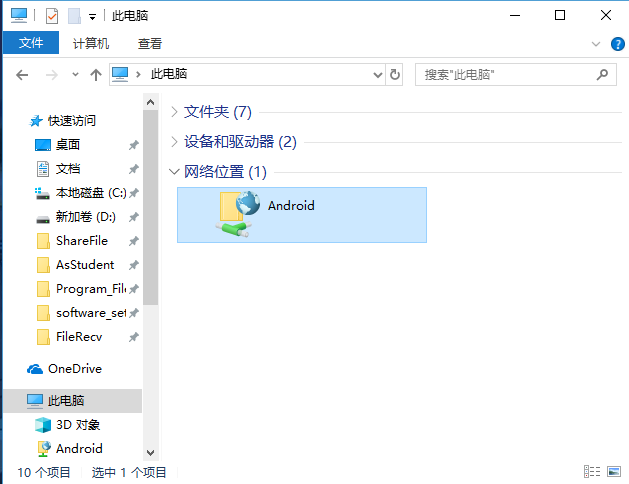

# Android2PC-Files-Share

包含项目描述，参考文献，项目计划，会议总结等内容。

---

## 项目描述

#### 1. 设计背景

- 随着智能手机的发展，手机移动端在人们生活中显得日渐重要。而出于娱乐、办公等方面的需要，手机端文件与PC端文件互相传输交流也成为了刚需。

- 对于手机访问PC端的共享文件，市面上已有较为成熟的解决方案（以Android手机为例）

  PC端设置文件共享+Android端安装`ES文件浏览器`

- 而PC端访问手机文件时，市面上也有一些解决方案，如MIUI自带的基于FTP的远程管理、ES文件浏览器的远程管理等。这些方案都有或多或少的弊端。

  |        解决方案        | 
弊端
                                        |
  | :--------------------: | ------------------------------------------------------------ |
  |   MIUI自带的远程管理   | 1. 必须使用小米手机 2. 无法设置特定的文件夹进行共享       |
  | ES文件浏览器的远程管理 | 1. APP集成度较高，功能众多，APP体量大 2. 无法使用用户名口令登录 3. 无法设置特定的文件夹进行共享 |
  |    其他文件管理方案    | 需要手机端与PC端同时安装软件                                 |

#### 2. 设计目标（功能描述）

1. 设计一款APP（Android2PC Files Share），实现当安卓手机与PC连在同一个局域网时，PC端能够便捷的使用windows自带的文件资源管理器管理安卓手机中的共享文件

2. 基本界面

   |                 Android端                 |                    PC端                     |
   | :---------------------------------------: | :-----------------------------------------: |
   |  |  |

3. 具体功能

   - 设置特定的共享文件
   - 实现用户口令登录

#### 3. 关键技术

1. APP实现在Android端搭建FTP服务器

   对比[apache ftp server](https://projects.apache.org/project.html?mina-ftpserver)与[swiftp](https://code.google.com/archive/p/swiftp/)的优劣再进行取舍

2. 在FTP服务器上实现共享特定文件夹与口令登录功能

## 项目计划

&nbsp;&nbsp;&nbsp;&nbsp;&nbsp;&nbsp;预计18年11月正式开始毕设，本学期最后一周（1月17日前）完成。

| 
时间段
 | 
计划内容
                              |
| ----------------------- | ------------------------------------------------------ |
| ~11月15日               | 查阅相关资料，比较两种方案，并选定其中一个进行毕设设计 |
| 11月15日~11月30日       | 写出基本的demo                                         |
| 11月30日~12月15日       | app调试完成                                            |
| 12月15日~12月30日       | 实现共享特定文件夹功能                                 |
| 12月30日~1月15日        | app调试完成                                            |

## 会议总结

#### 10.26 第一次会议

- 参考老师给定的第一个题目，`在手机中设定一个文件夹，当手机和电脑处于同一个局域网时，电脑中会出现一个文件夹`，查阅了相关资料，决定实现一个基于ad-hoc网络的文件共享系统
- 会议上导师的看法
  1. 手机需要root，并连接PC使用adb进行配置ad hoc网络模式，没有实际使用意义
  2. ad hoc网络研究热潮在十年前，由于运营商等方面的原因，认为其没有发展前景
- 于是放弃该想法，由于构想不成熟被毙，我根据构想找的论文也没有作用，所以决定于下次会议重新pre两篇论文

#### 10.30 第二次会议

- 由于家中有事，缺席第二次会议

